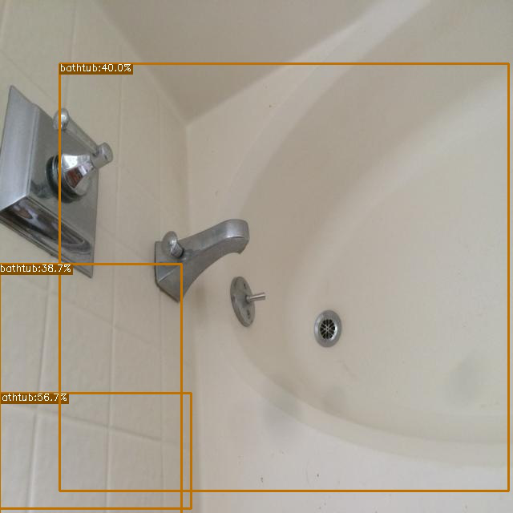
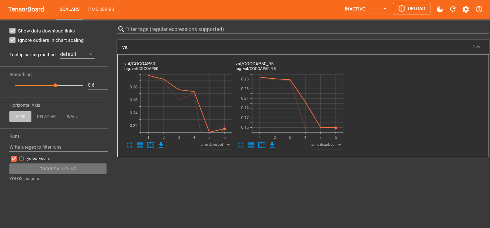
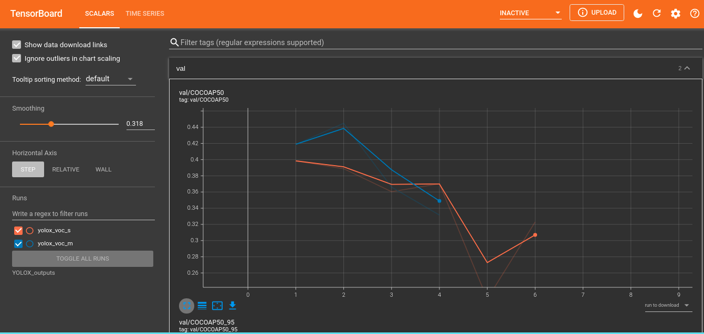

# Dminity

Train a YOLOX model to detect home amenities from images.

Significance: Small model size, Fast inference time, High accuracy
## Dataset 

OpenImageV6 with 30 labels for **object detection** task:

```
Toilet, Swimming_pool, Bed, Billiard_table, Sink, Fountain, Oven, Ceiling_fan,
Television, Microwave_oven, Gas_stove, Refrigerator,
Kitchen_&_dining_room_table, Washing_machine, Bathtub, Stairs, Fireplace,
Pillow, Mirror, Shower, Couch, Countertop, Coffeemaker, Dishwasher, Sofa_bed,
Tree_house, Towel, Porch, Wine_rack, Jacuzzi 
```

## Timeline

- [ ] Start small: We start with the end-to-end process with only 1 label first
  (Bathtub).
  - [X] Download OpenImageV6 for class Bathtub (use this
    [notebook](https://colab.research.google.com/drive/14ISeuv3frabPFo2F-giIzZdPr2dukmLW#scrollTo=tzyrJovZPa3I))
  - [X] Upload to Roboflow (TODO: YOLOX requires what image size?)
  - [X] Export as link
  - [X] Use the Roboflow YOLOX training notebook to train the model
  - [ ] Download the model and do inferences
  - [X] Setup either Weight & Biases or Tensorboard (edit the original YOLOX
    training notebook)
  - [X] Setup experiment environment with 3 variants of the YOLOX model (yolo-s,
    yolo-m, yolox)

- [ ] Experiment with 10 classes (to choose a model variant)
  - [X] Download OpenImageV6 for the 10 classes (use this
    [notebook](https://colab.research.google.com/drive/14ISeuv3frabPFo2F-giIzZdPr2dukmLW#scrollTo=tzyrJovZPa3I))
  - [ ] Upload to Roboflow
  - [ ] Export as link
  - [ ] Record the experiment result and make conclusion based on each variant's
    pros and cons

- [ ] Experiment with 200 images of all 30 classes
  - [X] Download OpenImageV6 for the all 30 classes and limit to 200 (use this
    [notebook](https://colab.research.google.com/drive/14ISeuv3frabPFo2F-giIzZdPr2dukmLW#scrollTo=tzyrJovZPa3I))
  - [ ] Upload to Roboflow
  - [ ] Export as link
  - [ ] Record the experiment result and make conclusion based on each variant's
    pros and cons

- [ ] Train with all 30 labels with the chosen model from last step
  - [ ] Download images for all 30 classes
  - [ ] Upload to Roboflow
  - [ ] Export as link
  - [ ] Train
  - [ ] Validate
  - [ ] Download model

- [ ] Create an MVP application (TODO)


## Log

<details>

  <summary>2021-08-29 - Environment setup</summary>

  Created a
  [notebook](https://colab.research.google.com/drive/14ISeuv3frabPFo2F-giIzZdPr2dukmLW#scrollTo=tIE5_pB4IeG6)
  Download Custom OpenImage Dataset and Upload to Google Drive.

  Uploaded custom dataset with 1 class -- Bathtub -- to roboflow.

  The
  [notebook](https://colab.research.google.com/drive/1eZk39KM8PubtwisTqWk_L-RT6c_ARN_K#scrollTo=s5h536amH32Z)
  for training YOLOX with roboflow requires Pascal VOC export format.

  [Here](https://github.com/Megvii-BaseDetection/YOLOX/blob/main/docs/manipulate_training_image_size.md)
  it says that YOLOX needs 640x640 input size. Yolo-tiny and Yolo-nano needs
  416x416.

  Tomorrow: 
  - [X] Download the 10 classes dataset and upload to drive
  - [X] Resize the Bathtub dataset to what YOLOX requires and continue with training
  - [X] setting up for experimentation.

</details>


<details>

  <summary>2021-08-31 - Trained with 1 class and setup for experimentation</summary>

  Trained using the notebook with the bathtub dataset. Confirmed that 640x640 is
  the correct input size for the model.

  The eval cell does'nt work, with an error of division with zero (the zero is the
  number of eval images, the `n_samples`). However, the folder containing eval
  list of images in `/content/YOLOX/datasets/VOC2012/ImageSets/Main/val.txt` does
  have a lot of items. TODO: look into the evaluator dataset loader script.

  Things to note: the train & test were successful although they're using the same
  dataloader.

  ```
  File "/content/YOLOX/yolox/evaluators/voc_evaluator.py", line 167, in evaluate_prediction
      a_infer_time = 1000 * inference_time / (n_samples * self.dataloader.batch_size)
                            │                 │           │    │          └ 64
                            │                 │           │    └ <torch.utils.data.dataloader.DataLoader object at 0x7fc4a27cdad0>
                            │                 │           └ <yolox.evaluators.voc_evaluator.VOCEvaluator object at 0x7fc4a27cd8d0>
                            │                 └ 0.0
                            └ 0.0

  ZeroDivisionError: float division by zero
  ```

  The first inference result (yolox-s):

  

#### Experimentation

  For the experimentation, I saw somewhere in the trainer that it writes to a
  tensorboard's `SummaryWriter`. If I can load it into tensorboard locally, I can
  see the result after training finished for the day & make conclusions.

  Path of the trainer: `/content/YOLOX/yolox/core/trainer.py`

  On line 178:

  ```Python
    # Tensorboard logger
    if self.rank == 0:
        self.tblogger = SummaryWriter(self.file_name)
  ```

  The Tensorboard events are stored in the experiment folder.

  Path: `/content/YOLOX_Outputs/<experiment_name>`

  Just zip the whole directory, mount gdrive and copy. Then, download to local and
  launch tensorboard locally to see the experiment.

  The trainer only writes the average precision though, idk if there are other
  useful information to get.

  TODO: check other information one can get from `tensorboard.SummaryWriter`

  

  To experiment with other yolox variants, 

  1. Download pretrained weights from [the checkpoint storage](https://github.com/Megvii-BaseDetection/storage/releases) 
  2. Copy dataloaders from the yolo_s example into `exps/default/<model_variant>`
     to make the train script load Pascal VOC format datasets
  3. Train
  4. Zip and download outputs
  5. Watch output in tensorboard locally

  **Tensorboard with the training outputs of yolox-s and yolox-m for bathtub:**

  

</details>


<details>

  <summary>2021-09-02 - Download 200 training images from each class</summary>

  08:30 -- Tried uploading the first 10 classes to roboflow with no limit (16275 train,
  1124 test, 280 validation). Browser kept going out of memory.

  However, roboflow has "add more image to a dataset" feature, so maybe we can
  upload 5 classes at a time for 30/5 = 6 times. Could take a day or two of
  downloading and uploading.

  That's a problem for when we want to do the end-to-end process with all the
  data. But today, we are going to do 10 classes at a time with a limit of 200
  data per class to start with experimentation.

  10:02 -- Uploading `OID_lim200_1-10` to roboflow (classes 1 through 10,
  limited to 200 images for each class.) and downloading `OID_lim200_11-20` from
  OpenImage.

  10:31 -- `OID_lim200_01-10` had some problem (didnt map the class code to
  class name). Need to redownload. `OID_lim200_11-20` works fine with a total of
  2479 images.

  12:41 -- Downloaded `OID_lim200_01-10`, `OID_lim200_11-20` &
  `OID_lim200_21-30` and created a new project on roboflow just for
  experimenting

  Here are all the number of images in each 10-class-bucket limit to 200 images
  each class that we need to upload:

  ```shell
  ╰─ ls OID_lim200_01-10/Dataset/*/*/*.jpg | wc -l
  2825

  ╰─ ls OID_lim200_11-20/Dataset/*/*/*.jpg | wc -l
  2479

  ╰─ ls OID_lim200_21-30/Dataset/*/*/*.jpg | wc -l
  1719
  ```

  And the size of each bucket:

  ```shell
  ╰─ du -hs OID_lim200_*
  1019M   OID_lim200_01-10
  886M    OID_lim200_11-20
  718M    OID_lim200_21-30
  ```

  14:17 -- Done for the day.

</details>

<details>

  <summary>2021-09-07 - Setup Repository</summary>

   ```
   . dminity/
   |__ dataset/
   | |__ download-custom-openimage-dataset.ipynb
   |__ train/
   | |__ experiment-yolox-variants.ipynb
   |__ deploy/ #TODO
   ```


</details>

<details>

  <summary>2021-09-08 - Explore YOLOX Code, create call graph viz</summary>

  - [ ] Setup ~weights and biases~ tensorboard in my [fork of the YOLOX repo](https://github.com/dolpheyn/YOLOX)

  ## Notes

  [draw io call graph for train](https://drive.google.com/file/d/1R-jK3SI4jDa73exhMATZGUfo2-oiHKwv/view?usp=sharing)

  If we give `--fp16` arg when executing `train.py`, it will adopt [mixed precision training](https://docs.nvidia.com/deeplearning/performance/mixed-precision-training/index.html)
  that will decrease memory usage and bandwith resulting to speed up in training.

  To show more things in tensorboard, add metrics to SummaryWriter
  (self.tblogger) in `yolox/core/trainer.py` in `Trainer::after_epoch` 
  [on this line](https://github.com/roboflow-ai/YOLOX/blob/main/yolox/core/trainer.py#L213)

</details>

<details>

  <summary>2021-09-11 - Explore YOLOX eval code</summary>

  Found where to add more scalar to tensorboard SummaryWriter (in
  `Trainer::evaluate_and_save_model`).

  Need to know where to get all the missing metrics in order to write to tb
  every epoch.

  Missing metrics:

  - [X] `train/loss`
  - [X] `train/box_loss`
  - [X] `train/obj_loss`
  - [X] `train/cls_loss`
  - [ ] `metrics/precision`
  - [ ] `metrics/recall`
  - [ ] `val/box_loss`
  - [ ] `val/obj_loss`
  - [ ] `val/cls_loss`
  - [X] `x/lr0`
  - [X] `x/lr1`
  - [X] `x/lr2`

  What are dem losses?

  `box_loss` is a loss that measures how "tight" the predicted bounding boxes
  are to the ground truth object (usually a regression loss, L1, smoothL1 etc.).

  `cls_loss` a loss that measures the correctness of the classification of each
  predicted bounding box: each box may contain an object class, or a
  "background". This loss is usually called cross entropy loss

  Where can I get the metrics?

  `train/*` and `metrics/*`: maybe from `outputs = model()`

  hyperparameters (`x/*`): maybe from optimizer

  TODO tomorrow: Output everything in outputs (in
  `trainer::train_for_one_iter`).

</details>

<details>

  <summary>2021-09-13 - </summary>


  Output of YOLOX each training iter:

  ```
  {
    'total_loss': tensor(13.5224, device='cuda:0', grad_fn=<AddBackward0>),
    'iou_loss': tensor(2.4550, device='cuda:0', grad_fn=<MulBackward0>),
    'l1_loss': 0.0,
    'conf_loss': tensor(7.1816, device='cuda:0', grad_fn=<DivBackward0>),
    'cls_loss': tensor(3.8858, device='cuda:0', grad_fn=<DivBackward0>),
    'num_fg': 5.926470588235294
  }
  ```

  Which is the return value of `yolox/models/yolo_head.py::forward()`

  ```
  344  return loss, reg_weight * loss_iou, loss_obj, loss_cls, loss_l1, num_fg / max(num_gts, 1)
  ```

  Which in `yolox/models/yolox.py::forward()` is assigned like this:

  ```
  loss, iou_loss, conf_loss, cls_loss, l1_loss, num_fg = self.head(
      fpn_outs, targets, x
  )
  ```

  So, `conf_loss` from `outputs` is `loss_obj` from head's outputs.

</details>

<details>

  <summary>2021-09-14</summary>

  **Setup validation**

  Created a script to list 1 img path for each class from the validation set.

  **Playing with batch size**

  Bigger batch size means lower steps per epoch since we are only correcting per
  N images with the average loss of all N images, where N is the batch size.

  This means that a larger batch size means faster training, but one implication
  that might happen is that our model can be worse and generalizing.

  One strategy that I can think of is: train for larger batch size early on for
  like 20 epochs, and then switch to a lower batch size and train for more
  epochs and wait for the model to perform better.

  I still think I need wandb to monitor experiments and provides a convenient
  way of reloading and resuming checkpoints, since it allows us to load past
  checkpoints from its artifact.

  ---

  **Batch size to number of steps per epoch**

  **Batch size 32** - 112 iters/epoch, mem: 9871, avg iter time: 2.655 Average
  forward time: 17.31 ms, Average NMS time: 4.25 ms, Average inference time:
  21.56 ms

  32 batch-size got CUDA out of mem error after the first epoch. Probs just
  stick to lower batch num. The 64 batch-size one didn't even got to the first
  epoch.

  **Batch size 16** - 223 iter/epoch, mem: 9799Mb, avg iter time: 2.085 Average
  forward time: 18.54 ms, Average NMS time: 4.79 ms, Average inference time:
  23.32 ms


</details>
